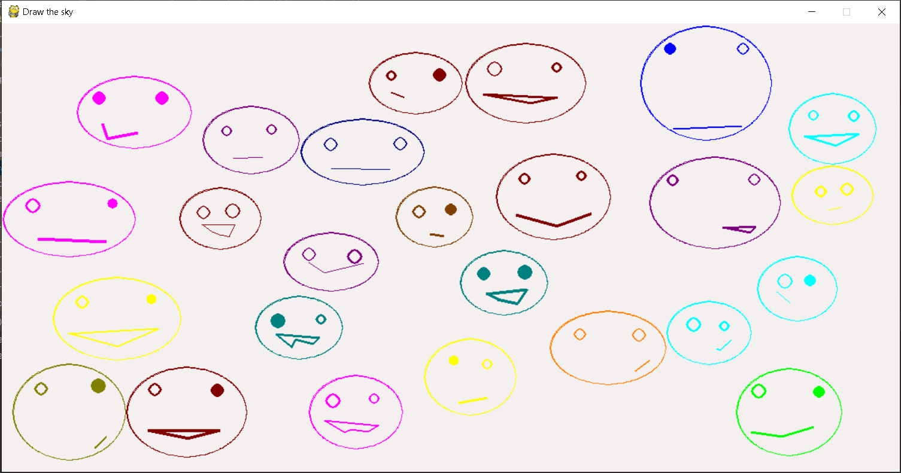
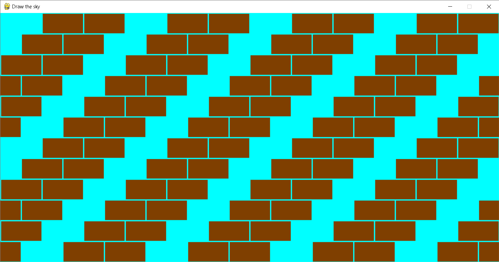

# Simple projects on Python

## Scripts on Python for misc tasks

* **Anagrams**

[This script](anagrams.py)
reverses all the words of input text: 
E.g. **`"abcd efgh" => "dcba hgfe"`** 
All non-letters symbols stays on the same places: 
E.g. **`"a1bcd efg!h => "d1cba hgf!e"`** 
Use Latin alphabet for use only

* **Дроби обыкновенные**

**ООП** концепция программирования с использованием ***классов*** 
[Программа](classes/fraction.py)
для операций с [обыкновенными дробями](https://ru.wikipedia.org/wiki/Дробь_(математика)#Обыкновенные_дроби):  
сложение, вычитание, умножение, перевод в десятичную дробь (с плавающей точной), скоращение дробей,
выделение целой части и поиск [НОД](https://ru.wikipedia.org/wiki/Наибольший_общий_делитель)

* **Исключения**

[Программа](exceptions/registration_log.py)
для проверки [log-файла](exceptions/registrations.txt)
регистраций пользователей на сайте на корректность введённых данных. 
Данные представлены в следующем виде: *имя*, *e-mail*, *возраст*. 
Обработка **исключений (exceptions)**. 
Программа обрабатывает файл и создаёт на выходе два log-файла: ***registrations_good.log***
(записываются правильные данные) и ***registrations_bad.log***
(записываются данные с ошибками и сообщения об ошибках)

* **Игра Nim**

Реализация математической игры **Nim** на **Python**.  
[Ним](https://ru.wikipedia.org/wiki/Ним_(игра)) — математическая игра, в которой два игрока по очереди берут предметы,
разложенные на несколько кучек. За один ход может быть взято любое количество предметов
(большее нуля) из одной кучки. Выигрывает игрок, взявший последний предмет. 
В программе есть
[модуль-**движок**](game_nim/nim_engine.py),
реализующий функциональность игры, и [модуль, реализующий логику работы с
пользователем](game_nim/nim_the_game.py)

* **Парсинг**

[**Скрипт для парсинга**](site_parser.py) сайта
[**Skillbox**](https://skillbox.ru/code) и получения списка всех курсов по професси ***"Программирование"***.
Задача усложняется тем, что на сайте подключен javascript движок на [nuxt.js](https://github.com/nuxt)
, который прячет часть содержимого сайта под катом. Разворачивается же весь список после нескольких нажатий на кнопку
"Ещё 10 профессий". Поэтому, если просто спарсить html-код исходной страницы, то требуемый результат не будет достигнут.

Для того, чтобы добиться нужного результата задействуем библиотеку [**Selenium**](https://www.selenium.dev/), при помощи
которой будем имитировать клик по кнопке для разворачивания полного списка курсов, представленных на сайте. Далее,
парсим html-код развёрнутой страницы при помощи библиотеки [**lxml.html**](https://lxml.de/lxmlhtml.html).

Необходимо установить библиотеки **Selenium** и **lxmi.html**, используя команду `pip install`

* **"Cумасшедший поезд"**

Логическая задачка про **поезд замкнутый в кольцо** с неизвестным количеством вагонов. Алгоритм поиска количества
вагонов в поезде
[реализованный](looped_crazy_train_puzzle.py) на **Python**

* **Smiles** 😊☺🙂😃😌

[**Randomly smiles**](randomly_smiles.py)  
Функция отрисовки рандомных смайликов с различными эмоциями в произвольной точке экрана. 
Смайлы отрисовываются до тех пор, пока не будет заполнено всё пространство экрана. 
Наложения смайлов друг на друга исключены.

Программа использует библиотеку [**simple_draw**](https://github.com/suguby/simple_draw) на базе
[**pygame**](https://www.pygame.org) движка

* **The Wall**

Отрисовка **стены** с узором

Программа использует библиотеку [**simple_draw**](https://github.com/suguby/simple_draw) на базе
[**pygame**](https://www.pygame.org) движка
